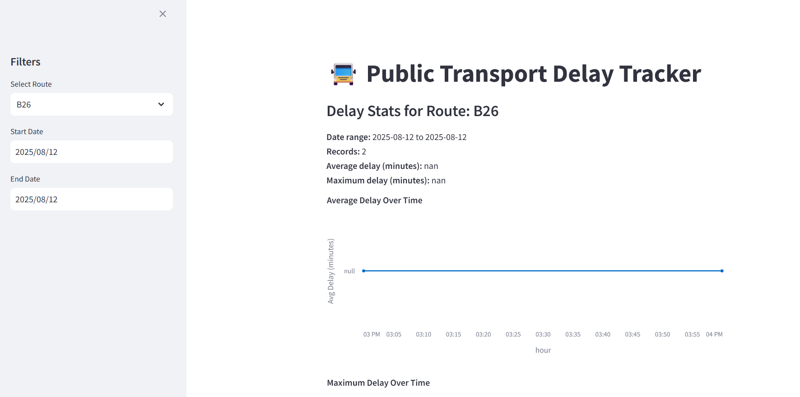

This is a mini project for ETL, I learnt about the **Medallion Architecture** — Bronze, Silver, Gold layers for structured data processing.  
To put it into practice, I built this quick ETL pipeline:  
- **Bronze** → Raw data ingestion  
- **Silver** → Cleaned & standardized data  
- **Gold** → Dashboard-ready data

### 📊 Dashboard Preview

